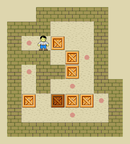

<h1 align="center">
  <br>
  
  
  <br>
  Sokoban
  <br>
</h1>

<h4 align="center">Un projet Epitech reprenant le jeu du Sokoban version TUI</a>.</h4>

<p align="center">
  <a href="#description">Description</a> •
  <a href="#key-features">Fonctionnalités</a> •
  <a href="#how-to-use">Prérequis</a> •
  <a href="#download">How To Use</a> •
  <a href="#credits">Crédits</a> •
  <a href="#license">License</a>
</p>



*jeu du sokoban*


*résultat sur un terminal*

## Description

Sokoban est un projet Epitech de première année qui met a contribution les les connaissances et l'apprentissage du TUI (Terminal User Interface) avec Ncurses en C.


## Fonctionalités

* Prise en charge de n'importes quelle maps au format txt
* collision et détection de défaite et de victoire
* Cross platform
  - Windows, macOS and Linux ready.


## Prérequis

- Git: pour cloner le dépôt.
- GCC: le compilateur pour compiler le code C.
- Make: pour automatiser le processus de compilation.
- Ncurses: Librairie graphique pour terminal

## How To Use

Pour cloner et exécuter cette application, vous aurez besoin de Git, GCC et Make installés sur votre ordinateur. Depuis votre ligne de commande :


```bash
# Clone this repository
$ git clone https://github.com/frnikho/sokoban

# Go into the repository
$ cd sokoban

# Install dependencies
$ make

# Run the app
$ ./my_sokoban
```


## Crédits

Ce RPG à été développer par les personnes suivantes:


> [Nicolas SANS](https://github.com/frnikho) &nbsp;&middot;&nbsp;
> GitHub [@frnikho](https://github.com/frnikho)


## License

MIT

## Screenshots


